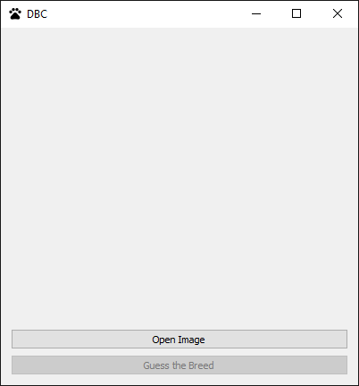
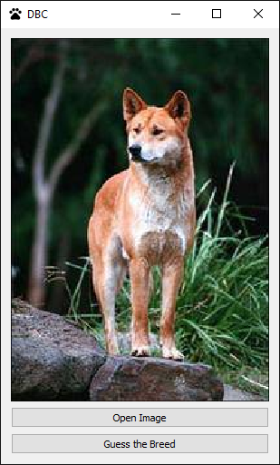
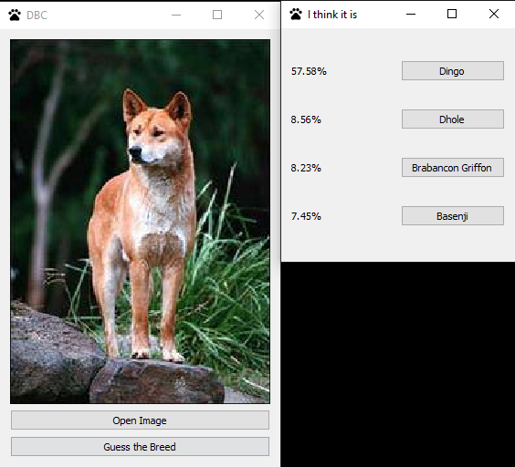
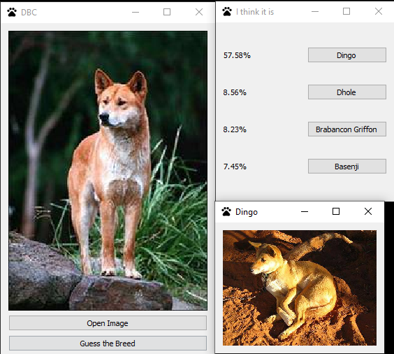

# Summer-Project-21

## Description

This repository contains a project created as part of a summer 
practice at Peter the Great St. Petersburg Polytechnic University. 
It is an application based on a deep learning convolutional model 
for solving the problem of determining the breed of dogs. 

Libraries were used to create the project: [keras](https://keras.io/), [pandas](https://pandas.pydata.org/), 
[scikit-learn](https://scikit-learn.org/stable/index.html), and [PyQt5](https://www.riverbankcomputing.com/static/Docs/PyQt5/introduction.html). 
The project is divided into two parts: 
[part_1](https://github.com/nikiforovta/Summer-Project-21/tree/Part_1), which implements two ways of creating a model (from scratch 
and using a ready-made base) and [part_2](https://github.com/nikiforovta/Summer-Project-21/tree/Part_2), in which the 
created model is used in a simple GUI application.

## Screenshots

